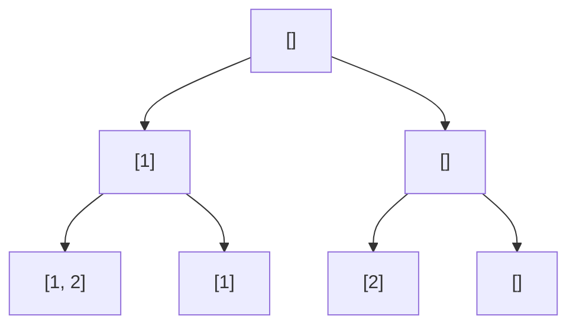

# LeetCode #1863

> **Difficulty:** Easy\
> **Link:** [LeetCode – Sum of All Subset XOR Totals](https://leetcode.com/problems/sum-of-all-subset-xor-totals/)

---

# Problem

The **XOR total** of an array is defined as the bitwise `XOR` of **all its elements**, or `0` if the array is **empty**.

- For example, the **XOR total** of the array `[2, 5, 6]` is `2 XOR 5 XOR 6 == 1`

Given an array `nums`, return _the **sum** of all **XOR totals** for every **subset** of `nums`_.

**Note:** Subsets with the **same** elements should be counted multiple times.

An array `a` is a **subset** of an array `b` if `a` can be obtained from `b` by deleting some (possible zero) elements of `b`.

### Examples

```
Input: nums = [1,3]
Output: 6
Explanation: The 4 subsets of [1, 3] are:
    - The empty subset has an XOR total of 0
    - [1] has an XOR total of 1.
    - [3] has an XOR total of 3.
    - [1, 3] has an XOR total of 1 XOR 3 = 2.

    0 + 1 + 3 + 2 = 6
```

```
Input: nums = [5, 1, 6]
Output: 28
Explanation: The 8 subsets of [5, 1, 6] are:
    - The empty subset has an XOR total of 0.
    - [5] has an XOR total of 5.
    - [1] has an XOR total of 1.
    - [6] has an XOR total of 6.
    - [5, 1] has an XOR total of 5 XOR 1 = 4.
    - [5, 6] has an XOR total of 5 XOR 6 = 3.
    - [1, 6] has an XOR total of 1 XOR 6 = 7. 
    - [5, 1, 6] has an XOR total of 5 XOR 1 XOR 6 = 2.

    0 + 5 + 1 + 6 + 4 + 3 + 7 + 2 = 28
```

```
Input: nums = [3, 4, 5, 6, 7, 8]
Output: 480
Explanation: The sum of all XOR totals for every subset is 480.
```

## Introduction

Although this problem is categorized as easy, the thought process to solve it is deceptively complex. While this problem tasks us with find the sum of total xor of each subset of a list, the more difficult part is actually program a way to look at each individual subset. We are't able to do a simple loop or use a sliding window to retrieve every possible subset. Because of this, the solution is found in utilizing a recursion (calling a function within itself) and depth first search (a powerful algorithm to iterate through a data structure).



### Approach

To begin solving, we first have to understand how we will be able iterate through every possible subset of a list. This is what we can use depth first search (DFS) for. DFS is an algorithm designed to walk through a structure to the deepest level before backtracking and going down another path. But, what does all that even mean?

## Solution 1: Brute Force

```python
def subsetXORSum(self, nums: List[int]) -> int:
    def recurse(nums, size_index, cur_subset, list_of_subsets):
        if size_index == len(nums):
            list_of_subsets.append(cur_subset[:])
            return
        else:
            cur_subset.append(nums[size_index])
            recurse(nums, size_index + 1, cur_subset, list_of_subsets)
            cur_subset.pop()
            recurse(nums, size_index + 1, cur_subset, list_of_subsets)

    all_subsets = []
    recurse(nums, 0, [], all_subsets)
    total = 0
    for i in all_subsets:
        subset_total = 0
        for value in i:
            subset_total = subset_total ^ value
        
        total += subset_total
    return total
```

## Solution 2: More Optimized DFS with XOR Accumulation

```python
def subsetXORSum(self, nums: List[int]) -> int:
    def dfs(index, total):
        if index == len(nums):
            return total
        next_index = index + 1
        return dfs(next_index, total ^ nums[index]) + dfs(next_index, total)

    return dfs(0, 0)
```
